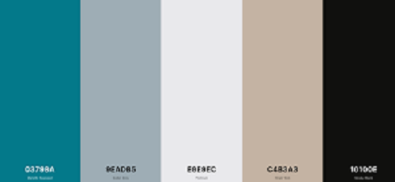
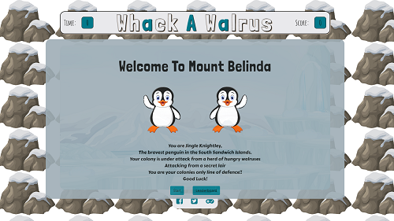
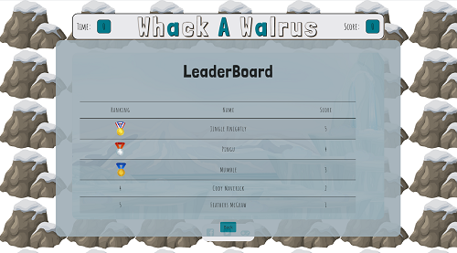
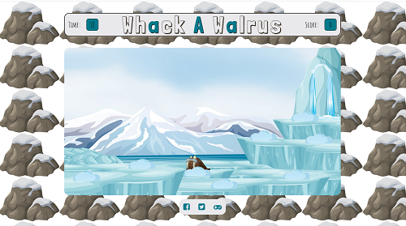
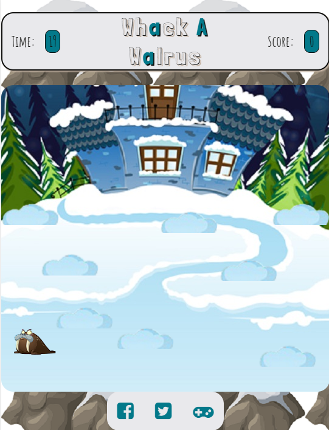
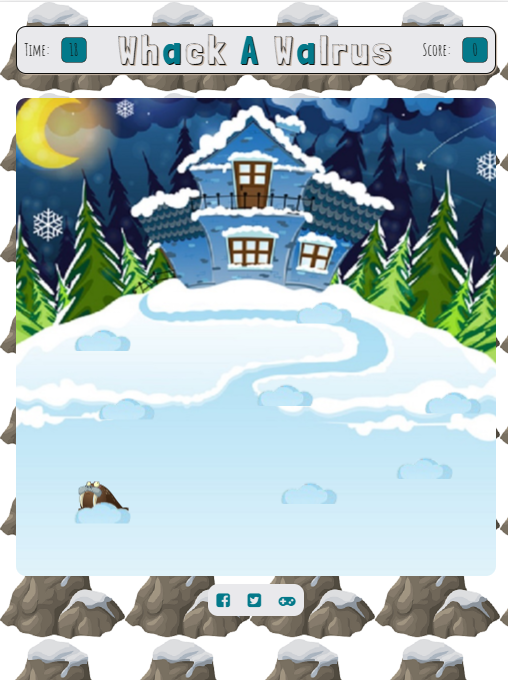
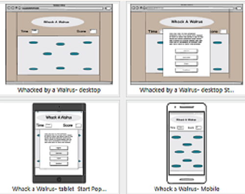
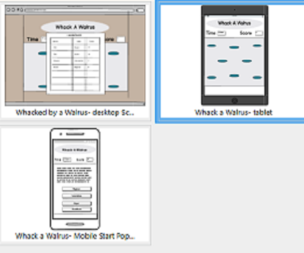

# Whack A Walrus

[View live project here](https://brimurphy.github.io/whackwalrus/)

Whack a Walrus is based on the old Whack-A-Mole arcade game.
It's designed to be fun and easy to play for all ages.

_This game is for educational purposes as part of my **Interactive Frontend Project**_

## Table of Contents

1. [User Experience](#ux)

- [User Stories](#user-stories)

- [Design](#design)

- [Features](#features)

- [Future Features](#future-features)

- [Wireframes](#wireframes)

- [Technologies Used](#technologies-used)

- [Testing](#testing)

2. [Deployment](#deployment)

- [GitHub](#github)

- [For Local Deployment](#for-local-deployment)

3. [Acknowledgements](#acknowledgements)

- [Code](#code)

- [Contents](#contents)

# Motivation

My motivation to build this game comes from my love of football,
more precisely the technology some clubs have been using to gain
an edge on their opponents. The Footbonaut is one of these
technologies that was brought in about 8 years ago and I feel
is a very evoled version of Whack-A-Mole. From such a simple
to play game came this idea which can help recovery from injuries
to ball control and passing abilities of the player. The term
Whack-A-Mole is also very topical at the moment as it is the name
of a strategy to tackle local coronavirus cases in the UK.

### Target audience

The target audience is from 7 years old up to anyone looking
to kill a few moments in their otherwise busy day.

## UX

### User Stories

- As a first time user I want to easily understand how to play the game.

- As a user I want simple game play.

- As a user I want to view the Highscores.

- As a user I want to have fun.

- As a user I want smooth game play.

### Design

- Colour Scheme

  - 

    I have used Color Palette #3652 from [Color Palettes](https://colorpalettes.net/color-palette-3652/)
    named Colors of Ice. I taught these colours really complimented the colours found
    in the colder climates of the games characters, the walrus and penguin.

- Typography

  - For the typography I have used [Google Fonts](https://fonts.google.com/).
    I've used the Londrina Solid and Shadow font for the headers,
    Amatic SC for the time, score and leaderboard text and
    Carter One for the story on the start game screen.
    These three styles really worked with the cartoonish graphics I had
    decided to go with for the game.

- Graphics

  - I decided to go with a cartoony look for the game, this was to ensure younger
    players could enjoy the game as much as older players.

    1. The penguin image is by @win_art on [Free pik](https://www.freepik.com/premium-vector/illustration-cartoon-funny-little-penguin-waving-hand_6410691.htm),
       I edited the grey to the black colour on the penguin to tie it in better.

    2. The walrus image is by Ahkâm on [Free Icons PNG](https://www.freeiconspng.com/img/48634)

    3. The laptop game image is by brgfx on [Free pik](https://www.freepik.com/free-vector/scene-with-snow-iceberg_6105157.htm)

    4. Tablet and mobile game image by Starder on [Free Design File](https://freedesignfile.com/204641-cartoon-house-with-winter-landscape-vector-03/)

    5. The background image is by OpenClipart-Vectors on [Pixabay](https://pixabay.com/vectors/rock-snow-snow-capped-boulder-576670/)

    6. The medals on the leaderboard are by Anglins on [Clean PNG](https://www.cleanpng.com/png-gold-medal-trophy-award-clip-art-medals-238071/download-png.html)

    7. The 'snow' is an image by Paydaytxtcouk on [FAVPNG](https://favpng.com/png_view/cartoon-cloud-blue-cloud-sky-pattern-png/j5U2THbs)

### Features

- This game is designed to be played on Desktop, Tablet and Mobile devices

When the game is loaded you are greeted by the welcome screen, which gives you two
options 1. To start the game and 2. to view the leaderboard of high scores

The leaderboard screen holds the names and scores of the 5 highest ranking players
and a back button to return to the previous page.

When the game is started the 20 second countdown begins and walruuses will pop up
at different snow clouds, if you can hit(click on) a walrus 1 point will be added to
your score. The game ends after 20 seconds and you are returned to the Welcome screen.

On Mobile and Tablets the game screen will be different, this was to help solve positioning issues on multiple
screen sizes. When a walrus is hit a 'Whack' sound is played to confirm the hit and the score should increase by one.

### Future Features

- Change mobile/tablet background image to be more inline with game story.
  Currently unable to find image that suits game story and is flexible for holes
  to make sense in positions on various screen sizes.

- Different playing backgrounds

- Animations on reaching highscore

- Add objects to avoid whacking to increase difficulty

### Wireframes

I have used Balsamiq to create my wireframes for this project,
they originally started as some very poor free hand drawings.
You can see the wireframes below:

### Technologies Used

- [HTML5](https://en.wikipedia.org/wiki/HTML5)

- [CSS3](https://en.wikipedia.org/wiki/CSS)

- [JavaScript](https://en.wikipedia.org/wiki/JavaScript)

- [Jasmine Unit Testing](https://cdnjs.com/libraries/jasmine)

- [GitHub](https://github.com/)

- [GitPod](https://www.gitpod.io/)

- [Bootstrap](https://getbootstrap.com/)

- [Google Fonts](https://fonts.google.com/)

- [Font Awesome](https://fontawesome.com/)

- [Remove bg](https://www.remove.bg/)

- [Favicon](https://favicon.io/)

### Testing

- HTML5 validated with:

  - [W3C HTML Validator](https://validator.w3.org/)

- CSS3 validated with:

  - [W3C CSS Validator](https://jigsaw.w3.org/css-validator/)

- JavaScript validated with:

  - [JS Hint](https://jshint.com/)

- Tested on following browsers and mobile networks

  - Chrome
  - Firefox
    - Bug: width: fit-content; not valid
    - Fix: display: table;
  - Microsoft Edge
  - Android
  - Apple

- Random testing used on all above formats

#### Bugs/Errors

- Error in console:
  Uncaught TypeError occurs when leaderboard already has 5 names in it
  The 6th score and any scores after would result in an error.
  textContent undefined as there is only 5 elements available for leaderboard.

  Fix:
  Hoisted .splice() method above for loop, under .sort(),
  so only 5 scores are ever entered into scoreboard,
  then for loop can sort if score makes it onto leaderboard.

- Overflow:
  Overflow: hidden on body element causing some screens to hiding game buttons.
  Manually have to zoom out to see buttons

  Fix:
  Remove overflow: hidden from body element to allow screen to scroll.

- Form value:
  The form for the leaderboard accepting empty value for leaderboard.

  Fix:
  JavaScript Form validation used to check if input value is empty.
  If empty red warning message to be displayed under input box.

* Testing User Stories

  - As a first time user I want to easily understand how to play the game

        Simple informative text on buttons for guidance around pop up pages.

  - As a user I want simple game play

        Click or tap action for 'whacking' with sound to confirm hit .

  - As a user I want to view the Highscores

        On welcome screen click Leaderboard to view Highscores.
        After game is over submit score to view Leaderboard.

  - As a user I want to have fun

        All testers said they enjoyed playing game. The cartoon feel made them want
         to attributed to the fun nature of the game.

  - As a user I want smooth game play

        Game starts when start button is pressed no freezing or stalling during game play.

## Deployment

### GitHub

This project is deployed by GitHub

1. Log in or Create account with GitHub.

2. Create repository.

3. Create HTML,CSS and JS files in Gitpod.

4. Push files to GitHub.

5. Click repository [Whack A Walrus](https://github.com/brimurphy/whackwalrus)

6. Go to repository settings.

7. Scroll down to GitHub Pages.

8. Click [Whack A Walrus](https://brimurphy.github.io/whackwalrus/) link to acces the site.

### For Local Deployment

1. Create a new folder to store the cloned files on your device.

2. If you need to download Git Bash we can download it [here](https://git-scm.com/downloads).

3. Once installed, open your new folder and inside it we can open Git Bash by right clicking
   and selecting Git Bash Here. Alternatively pressing the **Shift key** and **F10**
   will bring up the same menu and we can select Git Bash from the menu using the arrow
   keys and **Enter** to select. This will open Git Bash in the directory of our new folder.

4. Log into [GitHub](https://github.com/) and proceed to the [Whack A Walrus](https://github.com/brimurphy/whackwalrus) repository.

5. Above the files there is a _Code_ tab. When clicked will open a drop down menu, with
   **Clone**, **Open with GitHub Desktop** and **Download Zip** options. We are going to clone
   the repository, so under clone we select _HTTPS_ if not already selected and copy the URL
   by clicking the clipboard symbol beside it.

6. Now in Git Bash we can type _git clone_ and paste our copied URL, the insert button on windows
   will paste into Git Bash.

   > \$ git clone https://github.com/brimurphy/whackwalrus.git

7. Press Enter to create your local clone.

   > Cloning into 'whackwalrus'...
   > remote: Enumerating objects: 177, done.
   > remote: Counting objects: 100% (177/177), done.
   > remote: Compressing objects: 100% (108/108), done.
   > remote: Total 177 (delta 58), reused 156 (delta 49), pack-reused 0
   > Receiving objects: 100% (177/177), 7.52 MiB | 5.10 MiB/s, done.
   > Resolving deltas: 100% (58/58), done.

8. The repository is now cloned into your new folder.

For more details and downloaing instructions please click [Here](https://docs.github.com/en/github/creating-cloning-and-archiving-repositories/cloning-a-repository#cloning-a-repository-to-github-desktop)

## Acknowledgements

This project wouldn't of been possible without the help and support of so many people

- [Wes Bos](https://wesbos.com/courses) for his [JavaScript 30](https://javascript30.com/) course, without this I don't know what I would have done.
  The functionality of the game was based on his[Whack A Mole](https://www.youtube.com/watch?v=toNFfAaWghU) tutorial, I used this as my step by step guide
  fro building the game play, which relies heavily on the code from his tutorial.

- [Free Code Camps](https://www.freecodecamp.org/learn/) JS tutorials especially [John Smilga](https://www.freecodecamp.org/news/hone-your-javascript-skills-by-building-these-15-projects/)
  15 JavaScript Projects Full Course which I found very usefull at the start of the project to just get an idea of what I could build.

- [W3 Schools](https://www.w3schools.com/js/js_timing.asp), [JavaScript Info](https://javascript.info/settimeout-setinterval),
  [MDN web docs](https://developer.mozilla.org/en-US/docs/Learn/JavaScript/Asynchronous/Timeouts_and_intervals)
  for help getting my setTimeout function to work

- [W3 Resurce](https://www.w3resource.com/)
  for help getting the random hole function working, which created the randomness of where the walruses would pop up next.

- [MDN web docs](https://developer.mozilla.org/en-US/docs/Web/JavaScript/Reference/Global_Objects/Math/random)
  for helping with the random time function.

- [W3C](https://www.w3.org/wiki/CSS_absolute_and_fixed_positioning?source=post_page---------------------------)
  for the information on absolute and fixed position which helped position the snow pile and walruses.

- [CSS Tricks](https://css-tricks.com/almanac/properties/p/position/) Chris Coyier,
  for help with gaining a better understanding of position property.
  Which helped when positioning the snow piles and walruses.

- [W3 Schools](https://www.w3schools.com/js/js_validation.asp) and [Web Dev Simplified](https://www.youtube.com/watch?v=In0nB0ABaUk)
  for help understading JavaScript Form Validation.

- [Stack Overflow](https://stackoverflow.com/) for always having an answer for when I got stuck in a rabbit hole.

- Everybody in the Code Institute [Slack](https://app.slack.com/client/T0L30B202) page for your help and humour, I hope to be
  more active in the near future.

- [Code Institue](https://codeinstitute.net/) for the opportunity to change my career.

- Jonathan Munz for his expertise, knowledge, guidance and patience as I worked through this project.

- My Partner, daughter for allowing me the time to do this course, I know how much you have sacrificed so I can have the time to study.

- Family members and friends who have tested the game out for me and given me valuable feedback.

### Audio Content

- The 'Whack' sound on hitting a walrus was supplied by Keith Murphy from a Hanna Barbara Sound Effects cd he had.
  I used the third sound on track 58 '1 Hit, Cartoon Gravel Hit'. The full sound fx library can be found [here](https://archive.org/details/HB01SFX/58+1+Hit%2C+Cartoon+Gavel+Hit.mp3)

### Content

- Written content by Brian Murphy.
